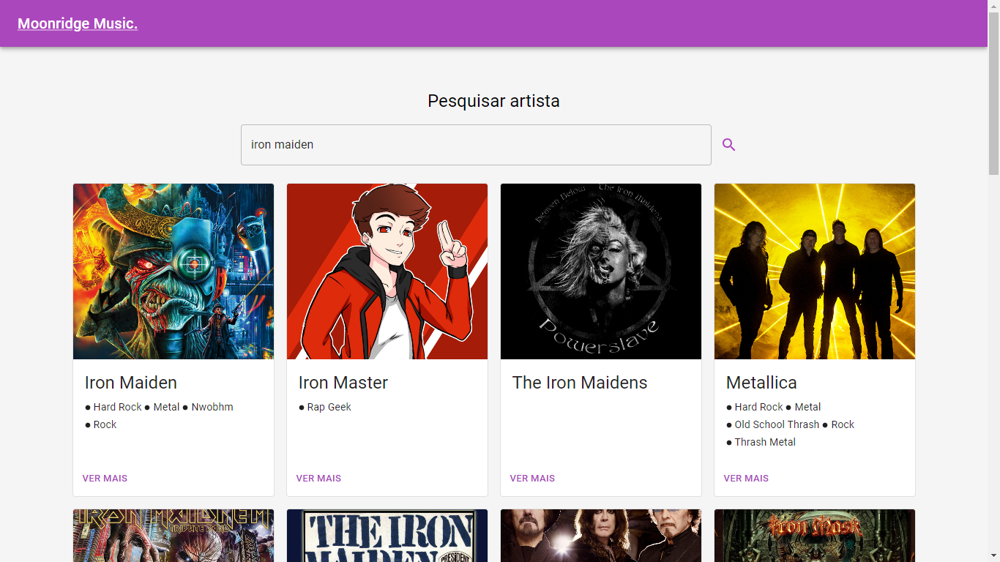

<h1 align="center"> Moonridge Music </h1>

<p align="center">
  <a href="#-tecnologias">Tecnologias</a>&nbsp;&nbsp;&nbsp;|&nbsp;&nbsp;&nbsp;
    <a href="#-instalacao-do-projeto">Instalação do projeto</a>&nbsp;&nbsp;&nbsp;|&nbsp;&nbsp;&nbsp;
  <a href="#-sobre-o-projeto">Sobre o Projeto</a>&nbsp;&nbsp;&nbsp;
</p>

<p align="center">
  
</p>

<p align="center">
  <a href="https://vs12-front-react-spotify.vercel.app/" target="_blank">➡️ Acesse o deploy!</a>
</p>

## 🚀 Tecnologias

Esse projeto foi desenvolvido com as seguintes tecnologias:

- React
- Material UI
- Typescript
- HTML/CSS

## ⚙️ Instalação do projeto

Passo-a-passo:

1. Comandos necessários para executar:

```
npm i
npm run dev
```

> Particularidades do projeto. Dependência externa.

## 💻 Sobre o Projeto

Este app é um pesquisador de artistas e álbuns, onde ao acessar as músicas, você é redirecionado ao Spotify.

- Links do figma (caso tiver)
<p align="center">
  <a href="https://www.figma.com/file/68VvVW4x1Ic5HoRuP9zHRy/Moonridge-Music?type=design&node-id=0%3A1&mode=design&t=lzncdjSermFuWYZt-1" target="_blank">➡️ Figma</a>
</p>
